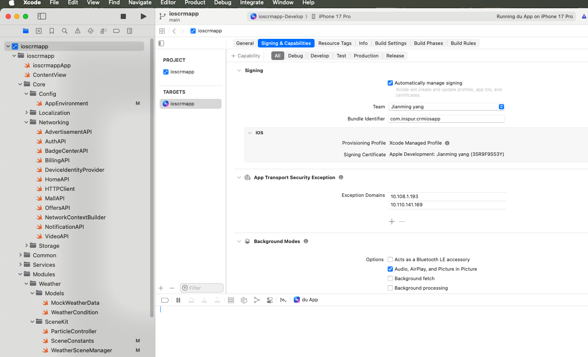
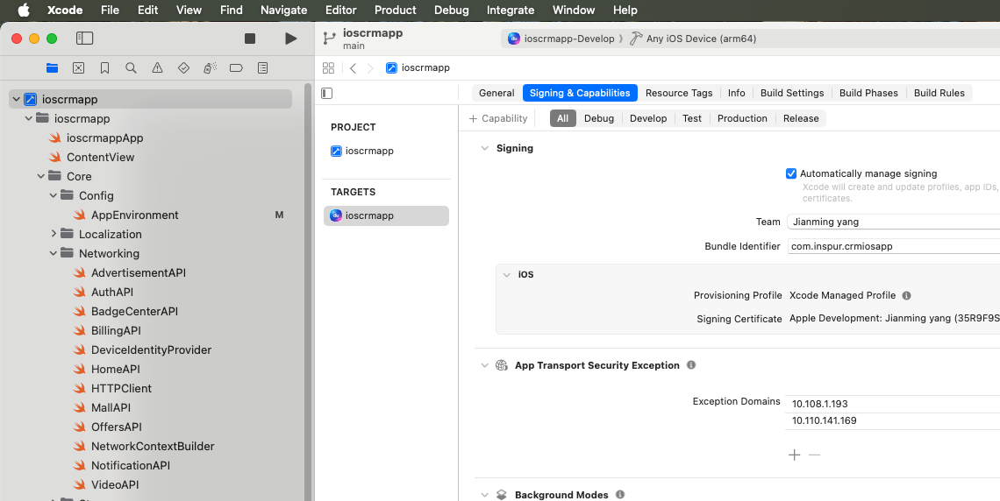
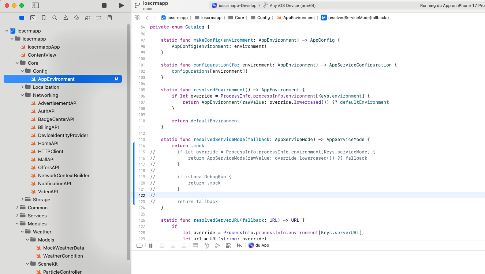
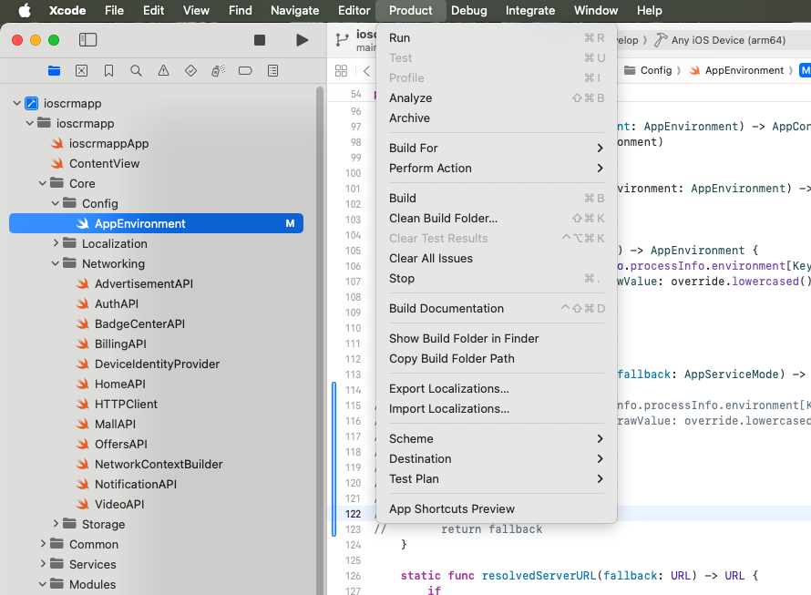
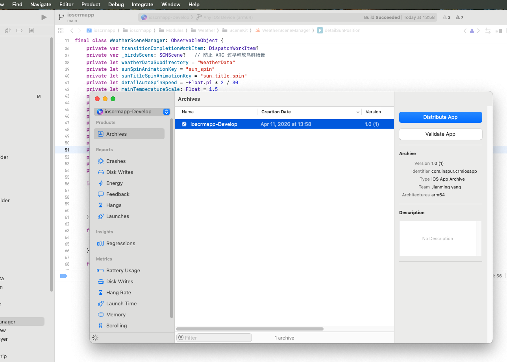
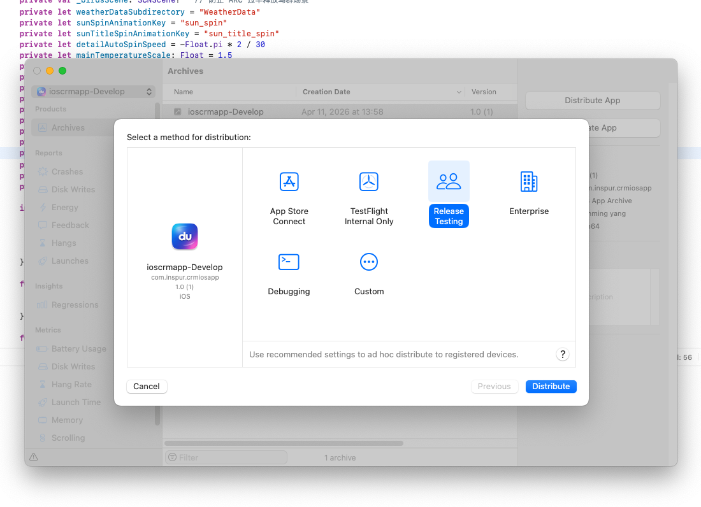
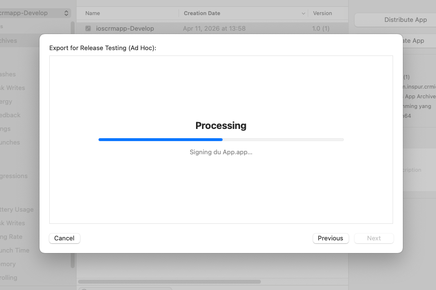
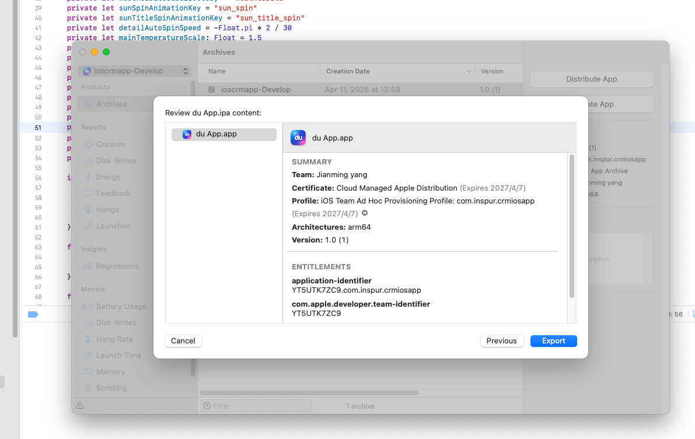
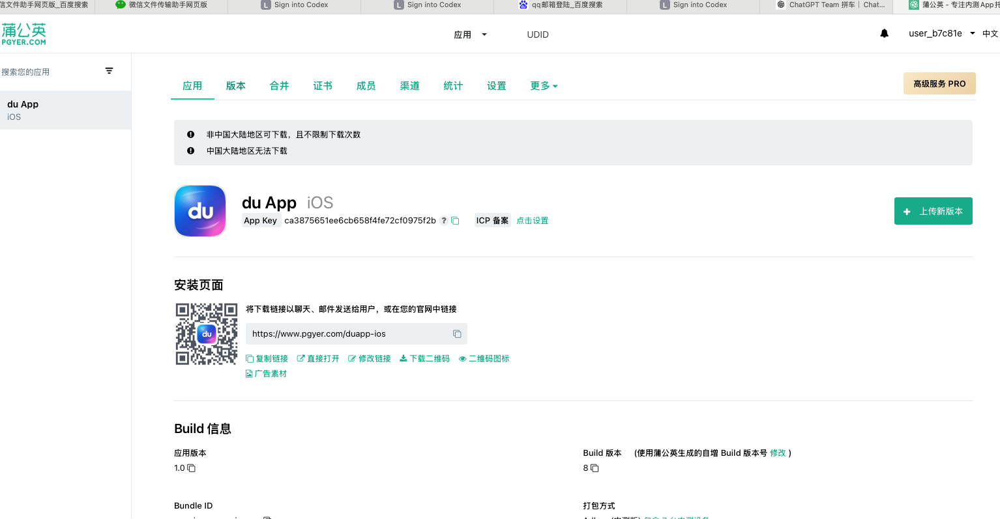

# iOS App 打包发布指南

本文档详细说明 iOS App 的打包流程及蒲公英发布步骤。

---

## 一、打包前准备

### 1.1 确认账号权限
- 使用 **建明总账号** 进行打包
- 确保证书和描述文件已正确配置

---

## 二、Xcode 打包流程

### 步骤 1：配置签名设置

1. 打开 Xcode 项目
2. 选中项目 Target，进入 **Signing & Capabilities** 标签页
3. 勾选 **Automatically manage signing**（自动管理签名）
4. 确认 Team 显示为 **Jianming yang**



---

### 步骤 2：选择目标设备

1. 在 Xcode 顶部工具栏的设备选择器中
2. 选择 **Any iOS Device (arm64)**

> ⚠️ 注意：必须选择 "Any iOS Device" 而不是具体的模拟器或真机，否则无法 Archive



---

### 步骤 3：修改环境配置（测试包必需）

1. 在项目中找到 **AppEnvironment.swift** 文件
   - 路径：`Core > Config > AppEnvironment`
2. 找到 `resolvedServiceMode` 方法
3. 确保返回值为 `.mock`

```swift
static func resolvedServiceMode(fallback: AppServiceMode) -> AppServiceMode {
    return .mock
    // ... 其他代码注释掉
}
```



---

### 步骤 4：清理并编译

1. 点击顶部菜单栏 **Product**
2. 先选择 **Clean Build Folder**（清理构建文件夹）
   - 快捷键：`Shift + Command + K`
3. 再次点击 **Product** 菜单
4. 选择 **Archive**（归档）
   - 快捷键：`Command + Shift + B`



---

### 步骤 5：等待编译完成

- 等待编译过程完成
- 编译成功后会自动弹出 **Archives** 对话框
- 显示已归档的 App 信息



---

### 步骤 6：分发应用

1. 在 Archives 对话框中，选中打出的包
2. 点击右侧的 **Distribute App** 按钮


---

### 步骤 7：选择分发方式

1. 在弹出的分发方式选择界面，选择 **Release Testing**（发布测试）
   - 用于 Ad Hoc 分发到已注册设备
2. 点击 **Distribute** 按钮



---

### 步骤 8：等待打包处理

- 系统会自动进行签名和处理
- 等待进度条完成



---

### 步骤 9：导出 IPA 文件

1. 处理完成后，显示应用信息确认界面
2. 确认信息无误后，点击 **Export** 按钮
3. 选择本地保存路径，将 IPA 包导出到本地



---

## 三、蒲公英发布流程

### 步骤 1：访问蒲公英平台

1. 打开浏览器，访问以下网址：
   ```
   https://www.pgyer.com/manager/dashboard/app/ca3875651ee6cb658f4fe72cf0975f2b
   ```

2. 联系 **王燕** 获取登录权限

### 步骤 2：上传新版本

1. 登录后进入应用管理页面
2. 找到 **du App iOS** 应用
3. 点击 **上传新版本** 按钮



### 步骤 3：完成上传

1. 选择刚才导出的 IPA 文件
2. 按页面提示填写版本信息
3. 点击上传，等待处理完成

---

## 四、注意事项

| 项目 | 说明 |
|------|------|
| 账号 | 必须使用建明总账号 |
| 签名 | 选择 Automatically manage signing |
| 设备 | 必须选择 Any iOS Device |
| 环境 | 测试包需要设置 return .mock |
| 清理 | 打包前务必 Clean Build Folder |
| 分发 | 测试包选择 Release Testing |

---

## 五、常见问题

**Q: Archive 选项是灰色的无法点击？**  
A: 请确认已选择 "Any iOS Device" 而不是模拟器。

**Q: 签名失败？**  
A: 检查是否使用正确的 Team 账号，并确认 Automatically manage signing 已勾选。

**Q: 蒲公英上传后无法下载？**  
A: 检查 IPA 是否正确签名，且设备 UDID 是否已添加到描述文件中。

---

*文档最后更新：2026-04-11*
